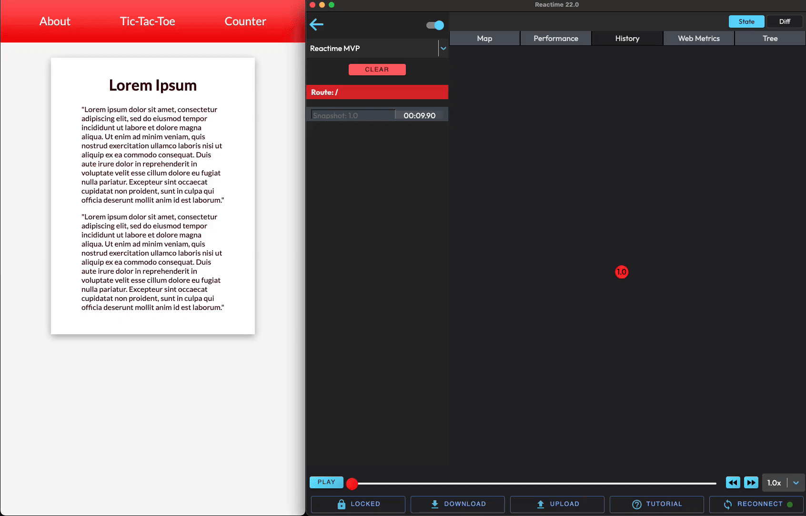
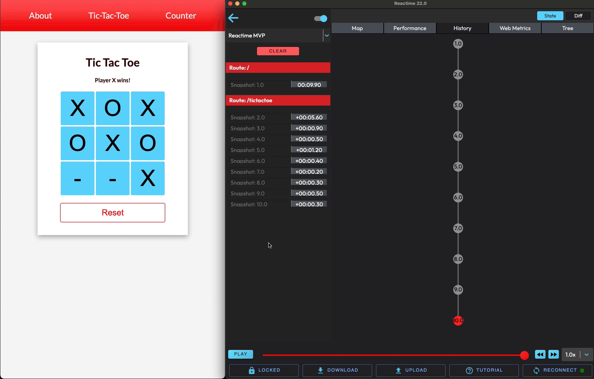
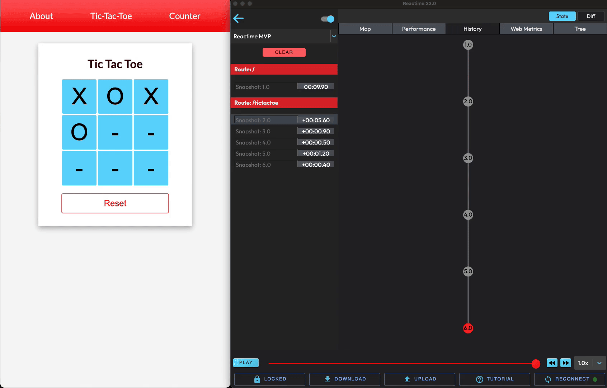

<h1 align="center">
   
    
     
     
  Outil de Performance pour React
     
    <a href="https://osawards.com/react/"> Nominé aux React Open Source Awards 2020 </a>
   
</h1>

<h4 align="center"> Reactime est un outil de performance et de débogage pour les développeurs React. Reactime enregistre un snapshot à chaque fois que l'état d'une application cible est modifié et permet à l'utilisateur de passer à tout état précédemment enregistré. </h4>

 

  
  
  
    
    

<!--      -->

<h5 align="center">
 
  <a href="./README.rus.md">🇷🇺  &nbsp; РУССКАЯ ВЕРСИЯ</a> &nbsp; • &nbsp;  <a href="./README.md">🇺🇸  &nbsp; ENGLISH VERSION </a>
   
</h5>
 

  <a href="https://www.reacti.me/">Website</a>

## <h1>Caractéristiques</h1>

### 🔹 L'Exposition

Vous pouvez afficher la structure des fichiers de votre application et cliquer sur un instantané pour afficher l'état de votre application. L'état peut être visualisé dans un graphique de composants, une arborescence JSON ou un graphique de performances. Les instantanés peuvent être comparés à l'instantané précédent, qui peut être visualisé en mode Diff.
 
 

 

### 🔹 Enregistrement

Chaque fois que l'état est modifié (chaque fois que setState, useState est appelé), cette extension créera un instantané de l'arborescence d'état actuelle et l'enregistrera. Chaque instantané sera affiché dans Chrome DevTools sous le panneau Reactime.
 
 

### 🔹 Série d'Instantanés et Comparaison d'Actions

Vous pouvez enregistrer une série d'instantanés d'état et l'utilizer pour analyser les changements dans les performances de rendu des composants entre la série d'instantanés actuelle et la série précédente. Vous pouvez également nommer les instantanés spécifiquement et comparer tous les instantanés avec le même nom.
 
 

### 🔹 Comparaison des Composants

Lorsque vous avez sélectionné un instantané, un visualisation des composants individuels de l'instantané sera affichée. Cela peut être fait sous le même onglet de performances où les instantanés sont rendus. Vous pouvez également voir les détails d'un composant lorsque vous le survolez avec votre souris.
 
 

### 🔹 Importer/Exporter des Instantanés

Vous pouvez exporter les instantanés sous forme de fichier JSON et les importer pour accéder aux arborescences d'état sur différentes sessions.
 
 

 

### 🔹 Reconnexion et Statut

Si Reactime se déconnecte de l'application que vous surveillez, cliquez sur le bouton « Reconnect » pour reprendre votre travail. Il y a un petit cercle sur le bouton. Il sera vert si vous êtes connecté et rouge si vous êtes déconnecté.
 
 

 

### 🔹 Optimisation du Rendu

L'un des problèmes les plus courants affectant les performances dans React est rednu plusieurs fois. Ce problème peut être résolu en vérifiant vos rendus dans le Onglet Performances dans Chrome DevTools sous le panneau Reactime.
 
 

### 🔹 Jumping

Un utilisateur peut accéder à n'importe quel instantané précédemment enregistré à l'aide de la barre latérale d'actions. Si un utilisateur appuie sur le bouton « Jump » sur un instantané, il pourra voir les informations d'état à partir du moment où cet instantané a été créé pour la première fois.
 
 

### 🔹 Gatsby

Reactime offre un support complet pour les applications Gatsby.
 
 

### 🔹 Next.js

Reactime propose des outils de débogage et de performances pour les applications Next.js : débogage de voyage dans le temps, évitant les rendus de composants inutiles et rendant votre application plus rapide.
 
 

### 🔹 Remix

Reactime propose des outils de débogage et de performances pour les applications Remix (en version bêta).
 
 

### 🔹 TypeScript

Reactime offre la prise en charge des applications TypeScript utilisant des composants de classe avec état et des composants fonctionnels. Des tests et un développement supplémentaires sont nécessaires pour les hooks personnalisés.
 
 

### Documentation

Après avoir cloné ce référentiel, les développeurs peuvent simplement exécuter `npm run docs` au niveau racine et servir le fichier `/docs/index.html` généré dynamiquement sur un navigateur. Cela fournira une vue GUI lisible, extensible et interactive de la structure et des interfaces de la base de code.
 
 

### <b>Caractéristiques Supplémentaires</b>

- Tutoriels pour des onglets spécifiques
- Passez la souris sur un composant pour afficher les détails de l'état
- Double-cliquez pour masquer les composants enfants
- Cliquez pour vous concentrer sur une partie de la carte des composants
- A dropdown to support the development of projects on multiple tabs
- Une liste déroulante pour accompagner le développement de projets sur plusieurs onglets
- Fonctionnalité verrouillée/déverrouillée permettant une pause temporaire de la surveillance de l'état
- Visualisation des propriétés à la fois en couleur et en épaisseur des branches reliant les composants
- Barre de chaleur sous le menu supérieur

<h1>Quoi de Neuf!</h1>

Reactime 25.0 comprend une nouvelle fonctionnalité de visualisation des propriétés et une barre de chaleur pour les développeurs !

Nous avons également résolu les problèmes de gel signalés précédemment au démarrage et avons amélioré la bibliothèque Jest, qui est maintenant en bien meilleur état qu'avant, avec la plupart des tests fonctionnant correctement.

Une partie de l'interface utilisateur a été réorganisée pour être plus esthétiquement agréable et pour rendre la fenêtre principale plus grande pour l'affichage de l'arbre des composants dans le processus.

<i>Regarder Plus Profondément</i>

En résolvant les problèmes persistants de déconnexion/d'écran noir qui affectaient parfois les utilisateurs lors de l'utilisation régulière de l'application, nous avons apporté des améliorations décisives en supprimant la fonction « keepAlive » et en implémentant une logique robuste pour résoudre le problème principal. Cela nous a permis d'affiner le protocole de communication entre notre application et le navigateur, offrant ainsi une connexion plus cohérente et stable. Cela offre aux utilisateurs une voie de récupération rapide et constitue également une couche de protection supplémentaire contre toute déconnexion inattendue à l'avenir.

Pour améliorer la maintenabilité, l'évolutivité et la longévité, nous avons mis à jour et supprimé progressivement certaines dépendances. Nous nous sommes éloignés de la bibliothèque Immer et avons transféré notre gestion d'état pour utiliser Redux Toolkit, tout en mettant à niveau l'API Web Vitals de la version 1.1.2 à 3.5.0, nous permettant d'utiliser une gamme plus large de métriques Web. Dans le cadre de cette transition, nous avons également converti tous les tests existants pour qu'ils fonctionnent avec le système de gestion d'état mis à jour, tout en élargissant encore les suites de tests pour augmenter la couverture globale des tests. Enfin, nous avons obtenu une augmentation notable de la couverture TypeScript, renforçant la qualité du code et la détection précoce des problèmes de développement potentiels.

Nous avons apporté de nombreux changements destinés à améliorer l'expérience utilisateur. Le premier est la fonction de reconnexion, conçue comme une mesure de protection pour les moments inattendus où un utilisateur est déconnecté. Lorsque cela se produit, une boîte de dialogue contextuelle intuitive apparaîtra instantanément, offrant aux utilisateurs un moyen transparent de replonger directement dans leur session, tout en offrant également la possibilité de télécharger des instantanés d'état enregistrés sous forme de fichier JSON. Nous avons également intégré un indicateur d'état dynamique qui affiche de manière transparente l'état actuel de l'application d'un utilisateur, indiquant s'il est en ligne ou hors ligne. Nous avons également enrichi l'application avec deux mesures de performances Web essentielles : « Cumulative Layout Shift » (CLS) et « Interaction to Next Paint » (INP). Ces mesures sont essentielles, car elles fournissent aux développeurs des informations sur la stabilité et la réactivité de la mise en page, leur permettant ainsi d'optimiser les interactions des utilisateurs avec précision.

Si vous souhaitez en savoir plus sur les versions précédentes, cliquez <a href="https://github.com/open-source-labs/reactime/releases">ici !</a>

<h1>Installation</h1>

Pour commencer, installer l’[extension](https://chrome.google.com/webstore/detail/reactime/cgibknllccemdnfhfpmjhffpjfeidjga) Reactime depuis le Chrome Web Store.

REMARQUE: L'[extension](https://chrome.google.com/webstore/detail/react-developer-tools/fmkadmapgofadopljbjfkapdkoienihi?hl=en) React Developer Tools est également requise pour que Reactime s'exécute, si vous ne l'avez pas déjà installé sur votre navigateur.

### <b>Installation Alternative</b>

Utilisez `src/extension/build/build.zip` pour une installation manuelle en [mode Développeur](https://developer.chrome.com/extensions/faq#faq-dev-01). Activez "Autoriser l'accès aux URL de fichiers" dans la page des détails de l'extension si vous effectuez un test local.

### Voulez-vous contribuer à Reactime ?

<i>Veuillez vous référer à la documentation du développeur pour un guide détaillé :</i>

Consultez [DEVELOPER README](src/README.md) pour plus d'informations sur le projet et des instructions sur la construction à partir des sources.

### <b>Manuel</b>

Après avoir installé l’extension Chrome Reactime, ouvrez votre application dans le navigateur.

Ensuite, ouvrez vos Chrome DevTools et accédez au panneau Reactime.

## <b>Diagnostic des anomalies</b>

### ❓ <b>Que faire quand Reactime ne trouve pas d’application React?</b>

Reactime s'exécute initialement à l'aide du hook global des outils de développement de l'API Chrome. Leur chargement dans Chrome peut prendre du temps. Essayez d'actualiser votre application plusieurs fois jusqu'à ce que Reactime s'exécute.

### ❓ <b>Un écran noir s’affiche à la place de l’extension Reactime</b>

Essayez d'actualiser l'application que vous souhaitez tester et actualisez les DevTools en cliquant sur le bouton droit de la souris «Recharger le cadre».

### ❓ <b>J’ai trouvé un bug dans Reactime</b>

Reactime est un projet open source, et toute aide de vore part sera grandement appréciée pour nous aider à améliorer l'expérience utilisateur. Veuillez créer une pull request (ou un problème) pour proposer et collaborer sur les modifications apportées à un référentiel.

## <b>En savoir plus</b>

- [Reactime: Real-time Debugging, Timeless Results](https://medium.com/@kelvinmirhan/reactime-real-time-debugging-timeless-results-3f163b721d01)

## <b>Auteurs</b>

- **Haider Ali** - [@hali03](https://github.com/hali03)
- **Jose Luis Sanchez** - [@JoseSanchez1996](https://github.com/JoseSanchez1996)
- **Logan Nelsen** - [@ljn16](https://github.com/ljn16)
- **Mel Koppens** - [@MelKoppens](https://github.com/MelKoppens)
- **Amy Yang** - [@ay7991](https://github.com/ay7991)
- **Eva Ury** - [@evaSUry](https://github.com/evaSUry)
- **Jesse Guerrero** - [@jguerrero35](https://github.com/jguerrero35)
- **Oliver Cho** - [@Oliver-Cho](https://github.com/Oliver-Cho)
- **Ben Margolius** - [@benmarg](https://github.com/benmarg)
- **Eric Yun** - [@ericsngyun](https://github.com/ericsngyun)
- **James Nghiem** - [@jemzir](https://github.com/jemzir)
- **Wilton Lee** - [@wiltonlee948](https://github.com/wiltonlee948)
- **David Kim** - [@codejunkie7](https://github.com/codejunkie7)
- **Robby Tipton** - [@RobbyTipton](https://github.com/RobbyTipton)
- **Kevin HoEun Lee** - [@khobread](https://github.com/khobread)
- **Christopher LeBrett** - [@fscgolden](https://github.com/fscgolden)
- **Joseph Park** - [@joeepark](https://github.com/joeepark)
- **Kris Sorensen** - [@kris-sorensen](https://github.com/kris-sorensen)
- **Daljit Gill** - [@dgill05](https://github.com/dgill05)
- **Ben Michareune** - [@bmichare](https://github.com/bmichare)
- **Dane Corpion** - [@danecorpion](https://github.com/danecorpion)
- **Harry Fox** - [@StackOverFlowWhereArtThou](https://github.com/StackOverFlowWhereArtThou)
- **Nathan Richardson** - [@BagelEnthusiast](https://github.com/BagelEnthusiast)
- **David Bernstein** - [@dangitbobbeh](https://github.com/dangitbobbeh)
- **Joseph Stern** - [@josephiswhere](https://github.com/josephiswhere)
- **Dennis Lopez** - [@DennisLpz](https://github.com/DennisLpz)
- **Cole Styron** - [@colestyron](https://github.com/C-STYR)
- **Ali Rahman** - [@CourageWolf](https://github.com/CourageWolf)
- **Caner Demir** - [@demircaner](https://github.com/demircaner)
- **Kevin Ngo** - [@kev-ngo](https://github.com/kev-ngo)
- **Becca Viner** - [@rtviner](https://github.com/rtviner)
- **Caitlin Chan** - [@caitlinchan23](https://github.com/caitlinchan23)
- **Kim Mai Nguyen** - [@Nkmai](https://github.com/Nkmai)
- **Tania Lind** - [@lind-tania](https://github.com/lind-tania)
- **Alex Landeros** - [@AlexanderLanderos](https://github.com/AlexanderLanderos)
- **Chris Guizzetti** - [@guizzettic](https://github.com/guizzettic)
- **Jason Victor** - [@theqwertypusher](https://github.com/Theqwertypusher)
- **Sanjay Lavingia** - [@sanjaylavingia](https://github.com/sanjaylavingia)
- **Vincent Nguyen** - [@VNguyenCode](https://github.com/VNguyenCode)
- **Haejin Jo** - [@haejinjo](https://github.com/haejinjo)
- **Hien Nguyen** - [@hienqn](https://github.com/hienqn)
- **Jack Crish** - [@JackC27](https://github.com/JackC27)
- **Kevin Fey** - [@kevinfey](https://github.com/kevinfey)
- **Carlos Perez** - [@crperezt](https://github.com/crperezt)
- **Edwin Menendez** - [@edwinjmenendez](https://github.com/edwinjmenendez)
- **Gabriela Jardim Aquino** - [@aquinojardim](https://github.com/aquinojardim)
- **Greg Panciera** - [@gpanciera](https://github.com/gpanciera)
- **Nathanael Wa Mwenze** - [@nmwenz90](https://github.com/nmwenz90)
- **Ryan Dang** - [@rydang](https://github.com/rydang)
- **Bryan Lee** - [@mylee1995](https://github.com/mylee1995)
- **Josh Kim** - [@joshua0308](https://github.com/joshua0308)
- **Sierra Swaby** - [@starkspark](https://github.com/starkspark)
- **Ruth Anam** - [@peachiecodes](https://github.com/peachiecodes)
- **David Chai** - [@davidchaidev](https://github.com/davidchai717)
- **Yujin Kang** - [@yujinkay](https://github.com/yujinkay)
- **Andy Wong** - [@andywongdev](https://github.com/andywongdev)
- **Chris Flannery** - [@chriswillsflannery](https://github.com/chriswillsflannery)
- **Rajeeb Banstola** - [@rajeebthegreat](https://github.com/rajeebthegreat)
- **Prasanna Malla** - [@prasmalla](https://github.com/prasmalla)
- **Rocky Lin** - [@rocky9413](https://github.com/rocky9413)
- **Abaas Khorrami** - [@dubalol](https://github.com/dubalol)
- **Ergi Shehu** - [@Ergi516](https://github.com/ergi516)
- **Raymond Kwan** - [@rkwn](https://github.com/rkwn)
- **Joshua Howard** - [@Joshua-Howard](https://github.com/joshua-howard)
- **Lina Shin** - [@rxlina](https://github.com/rxlina)
- **Andy Tsou** - [@andytsou19](https://github.com/andytsou19)
- **Feiyi Wu** - [@FreyaWu](https://github.com/FreyaWu)
- **Viet Nguyen** - [@vnguyen95](https://github.com/vnguyen95)
- **Alex Gomez** - [@alexgomez9](https://github.com/alexgomez9)
- **Edar Liu** - [@liuedar](https://github.com/liuedar)
- **Kristina Wallen** - [@kristinawallen](https://github.com/kristinawallen)
- **Quan Le** - [@blachfog](https://github.com/Blachfog)
- **Robert Maeda** - [@robmaeda](https://github.com/robmaeda)
- **Lance Ziegler** - [@lanceziegler](https://github.com/lanceziegler)
- **Ngoc Zwolinski** - [@ngoczwolinski](https://github.com/ngoczwolinski)
- **Peter Lam** - [@dev-plam](https://github.com/dev-plam)
- **Zachary Freeman** - [@zacharydfreeman](https://github.com/zacharydfreeman/)
- **Jackie Yuan** - [@yuanjackie1](https://github.com/yuanjackie1)
- **Jasmine Noor** - [@jasnoo](https://github.com/jasnoo)
- **Minzo Kim** - [@minzo-kim](https://github.com/minzo-kim)
- **Mark Teets** - [@MarkTeets](https://github.com/MarkTeets)
- **Nick Huemmer** - [@NickHuemmer](https://github.com/ElDuke717)
- **James McCollough** - [@j-mccoll](https://github.com/j-mccoll)
- **Mike Bednarz** - [@mikebednarz](https://github.com/mikebednarz)
- **Sergei Liubchenko** - [@sergeylvq](https://github.com/sergeylvq)
- **Christopher Stamper** - [@ctstamper](https://github.com/ctstamper)
- **Jimmy Phy** - [@jimmally](https://github.com/jimmally)
- **Andrew Byun** - [@AndrewByun](https://github.com/AndrewByun)
- **Kelvin Mirhan** - [@kelvinmirhan](https://github.com/kelvinmirhan)

## <b>License </b>

Ce projet est sous licence MIT - voir le fichier [LICENSE](LICENSE) pour plus de détails
