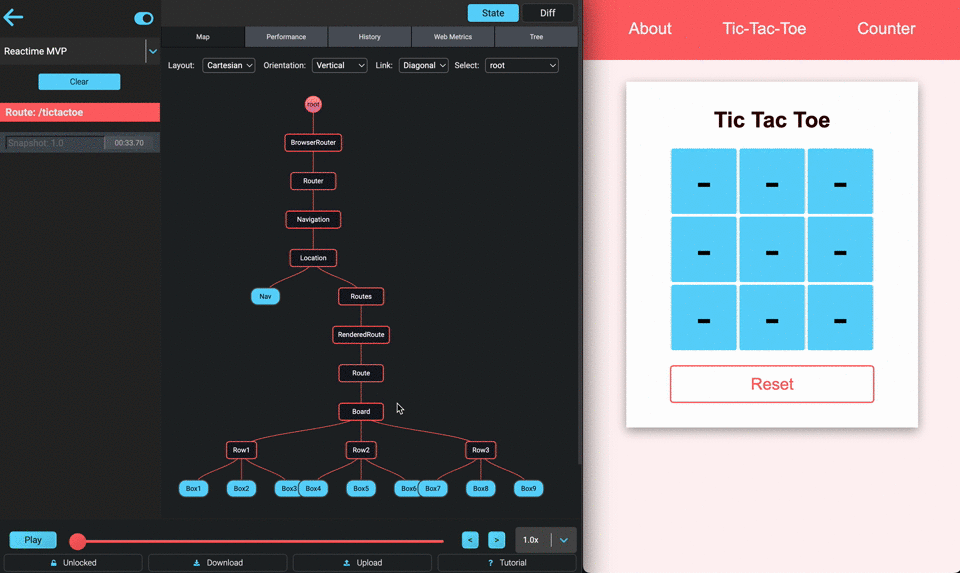
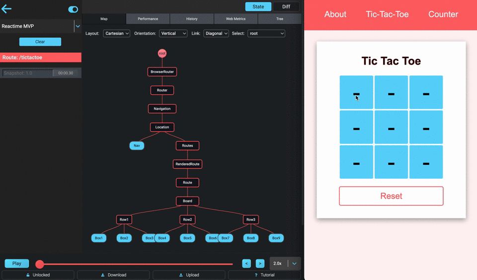
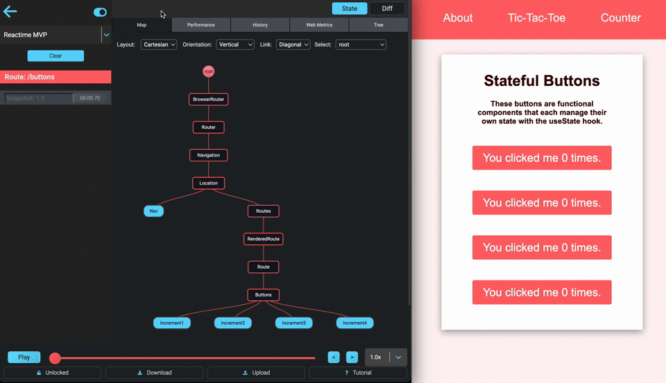
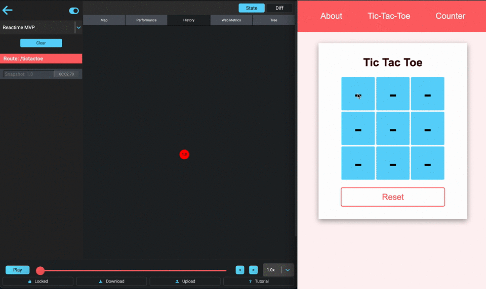

<h1 align="center">
   
    
     
     
  React Performance Tool
     
    <a href="https://osawards.com/react/"> Nominated for React Open Source Awards 2020 </a>
   
</h1>

<h4 align="center"> Reactime is an open source Chrome developer tool for time travel debugging and performance monitoring in React applications. Reactime enables developers to record snapshots of application state, jump between and inspect state snapshots, and monitor performance metrics such as component render time and render frequency. </h4>

 

  
    
    

<h5 align="center">
 
  <a href="./README.rus.md">🇷🇺  &nbsp; РУССКАЯ ВЕРСИЯ</a> &nbsp; • &nbsp;  <a href="./README.fr.md">🇫🇷  &nbsp; VERSION FRANÇAISE</a> &nbsp; • &nbsp; <a href='./src/README.md'>DEVELOPER README</a>
   
</h5>
 

  <a href="https://www.reacti.me/">Website</a> 

## <h1>Features</h1>

### 🔹 Viewing

You can view your application's file structure and click on a snapshot to view
your app's state. State can be visualized in a Component Graph, JSON Tree, or
Performance Graph. Snapshots can be compared with the previous snapshot, which can
be viewed in Diff mode.
 
 

 

### 🔹 Snapshot Series and Action Comparison

You can save a series of state snapshots and use it to analyze changes in
component render performance between current and previous series of snapshots.
You can also name specific snapshots and compare all snapshots with the same
name.
 
 

<!-- 

 -->

### 🔹 Components Comparison

When toggled to a specific snapshot, a visualization of the individual
components of the snapshot will be displayed. This can be done under the same
Performance tab where the snapshots are rendered. You will also find details of
each component upon hovering.
 
 

 

### 🔹 Recording

Whenever state is changed (whenever setState, useState is called), this
extension will create a snapshot of the current state tree and record it. Each
snapshot will be displayed in Chrome DevTools under the Reactime panel.
 
 

 

### 🔹 Re-render Optimization

One of the most common issues that affects performance in React is unnecessary
render cycles. This problem can be fixed by checking your renders in the
Performance tab in Chrome DevTools under the Reactime panel.

### 🔹 Jumping

Using the actions sidebar, a user can jump to any previous recorded snapshots.
Hitting the jump button on any snapshot will allow a user to view state data at
any point in the history of the target application.

### 🔹 Gatsby

Reactime offers full support for Gatsby applications. You would be able to
identify unnecessary renders, duration of each rendering, travel-debugging
features and visual representation of the tree components.

### 🔹 Next.js

Reactime offers debugging and performance tools for Next.js apps: time-traveling
debugging, preventing unnecessary components re-renders and making your
application faster.

### 🔹 Remix

Reactime offers debugging and performance tools for Remix apps (in beta). Support still
needs to be added for multi-route time traveling. Every other feature works.

### 🔹 TypeScript Support

Reactime offers support for TypeScript applications using stateful class
components and functional components. Further testing and development is
required for custom hooks, and Concurrent Mode.

### 🔹 Documentation

After cloning this repository, developers can simply run `npm run docs` at the
root level and serve the dynamically generated `/docs/index.html` file on a
browser. Doing so will provide a readable, extensible, and interactive GUI view
of the structure and interfaces of the codebase.
 

### <b>Additional Features</b>

- In-app tab specific tutorial walkthroughs
- Hover over a component to view tooltip details on state visualizations
- Double-click to collapse child components
- Click to focus on a portion of the component map
- A dropdown to support development of projects on multiple tabs
- Intuitive navigation between state snapshots
- Download/upload the current snapshots in memory
- Locked/unlocked feature allowing temporary pause of state monitoring

<h1>What's New!</h1>

<b>Reactime 19.0</b> comes with UI updates to enhance the developer's experience, as well as a much-needed revamping of the codebase to reflect current industry standards and better maintainability for future contributors.

<i>UI Updates</i>

To handle displaying large amounts of data, we have changed how nested structures like objects and arrays are displayed to now be collapsible and scrollable. In addition, we've updated component information to include the necessary component "key" information, and data now also persists on hover, eliminating the need to leave the cursor in one place.

<i>Under the Hood</i>

We are happy to say that we've migrated from Enzyme to React Testing Library to eliminate the need for the Enzyme adapter, converted from JavaScript to TypeScript to ensure type safety, and updated the traversal of the React Fiber Tree to accurately extract useState data for previously unsupported edge cases.

If you would like to read more about previous releases, click <a href="https://github.com/open-source-labs/reactime/releases">here!</a>

<h1>Installation</h1>

To get started, install the Reactime
[extension](https://chrome.google.com/webstore/detail/reactime/cgibknllccemdnfhfpmjhffpjfeidjga)
from Chrome Web Store.

After installing Reactime, you can test its functionalities with your React
application in development mode.

Please note, the time jumping feature will <b>ONLY</b> work when your
application is running in <b>development mode</b>. In production mode, you are
able to view your application’s component map but no additional features.

NOTE: The React Developer Tools
[extension](https://chrome.google.com/webstore/detail/react-developer-tools/fmkadmapgofadopljbjfkapdkoienihi?hl=en)
is also required for Reactime to run, if you do not already have it installed on
your browser.

### Manual Installation

Go to Chrome Extensions (make sure Chrome Extension is in Developer Mode) for
manual installation in (https://developer.chrome.com/extensions/faq#faq-dev-01)
and click on Load Unpacked. Use `src/extension/build/` to load this extension.
Turn on 'Allow access to file URLs' in extension details page if testing
locally.

### Looking to contribute to Reactime?

<i>Please refer to Developer Install for a detailed guide:</i>

Refer [DEVELOPER README](src/README.md) for more info on the project, and
instructions on building from source.

### <b>How to Use</b>

After installing the Chrome extension, just open up your project in the browser.

Then open up your Chrome DevTools and navigate to the Reactime panel.

## <b>Troubleshooting</b>

### ❓ <b>Why is Reactime telling me that no React application is found?</b>

Reactime initially runs using the dev tools global hook from the Chrome API. It
takes time for Chrome to load this. Try refreshing your application a couple
times until you see Reactime running.

### ❓ <b>Why do I need to have React Dev Tools enabled?</b>

Reactime works in tandem with the React Developer Tools to access a React application's Fiber tree; under the hood, Reactime traverses the Fiber tree through the React Developer Tool's global hook, pulling all relevant information needed to display to the developer

### ❓ <b>There is a black screen instead of the Reactime extension</b>

Try refreshing the application you want to test and refresh the DevTools by
clicking the right mouse button “Reload frame”.

### ❓ <b>I found a bug in Reactime</b>

Reactime is an open source project, and we'd love to hear from you about
improving the user experience. Please read [DEVELOPER README](src/README.md),
and create a pull request (or issue) to propose and collaborate on changes to Reactime.

### ❓ <b>Node version compatiability</b>

With release of Node v18.12.1(LTS) on 11/4/22, the script has been updated to
'npm run dev' | 'npm run build' for backwards compatibility.  For version
Node v16.16.0, please use script 'npm run devlegacy' | 'npm run buildlegacy'

## <b>Read More</b>

- [It's time for Reactime 19.0!](linkhere)

## <b>Authors</b>

- **Ben Margolius** - [@benmarg](https://github.com/benmarg)
- **Eric Yun** - [@ericsngyun](https://github.com/ericsngyun)
- **James Nghiem** - [@jemzir](https://github.com/jemzir)
- **Wilton Lee** - [@wiltonlee948](https://github.com/wiltonlee948)
- **Louis Lam** - [@llam722](https://github.com/llam722)
- **Samuel Tran** - [@leumastr](https://github.com/leumastr)
- **Brian Yang** - [@yangbrian310](https://github.com/yangbrian310)
- **Emin Tahirov** - [@eminthrv](https://github.com/eminthrv)
- **Peng Dong** - [@d28601581](https://github.com/d28601581)
- **Ozair Ghulam** - [@ozairgh](https://github.com/ozairgh)
- **Christina Or** - [@christinaor](https://github.com/christinaor)
- **Khanh Bui** - [@AndyB909](https://github.com/AndyB909)
- **David Kim** - [@codejunkie7](https://github.com/codejunkie7)
- **Robby Tipton** - [@RobbyTipton](https://github.com/RobbyTipton)
- **Kevin HoEun Lee** - [@khobread](https://github.com/khobread)
- **Christopher LeBrett** - [@fscgolden](https://github.com/fscgolden)
- **Joseph Park** - [@joeepark](https://github.com/joeepark)
- **Kris Sorensen** - [@kris-sorensen](https://github.com/kris-sorensen)
- **Daljit Gill** - [@dgill05](https://github.com/dgill05)
- **Ben Michareune** - [@bmichare](https://github.com/bmichare)
- **Dane Corpion** - [@danecorpion](https://github.com/danecorpion)
- **Harry Fox** -
  [@StackOverFlowWhereArtThou](https://github.com/StackOverFlowWhereArtThou)
- **Nathan Richardson** - [@BagelEnthusiast](https://github.com/BagelEnthusiast)
- **David Bernstein** - [@dangitbobbeh](https://github.com/dangitbobbeh)
- **Joseph Stern** - [@josephiswhere](https://github.com/josephiswhere)
- **Dennis Lopez** - [@DennisLpz](https://github.com/DennisLpz)
- **Cole Styron** - [@colestyron](https://github.com/C-STYR)
- **Ali Rahman** - [@CourageWolf](https://github.com/CourageWolf)
- **Caner Demir** - [@demircaner](https://github.com/demircaner)
- **Kevin Ngo** - [@kev-ngo](https://github.com/kev-ngo)
- **Becca Viner** - [@rtviner](https://github.com/rtviner)
- **Caitlin Chan** - [@caitlinchan23](https://github.com/caitlinchan23)
- **Kim Mai Nguyen** - [@Nkmai](https://github.com/Nkmai)
- **Tania Lind** - [@lind-tania](https://github.com/lind-tania)
- **Alex Landeros** - [@AlexanderLanderos](https://github.com/AlexanderLanderos)
- **Chris Guizzetti** - [@guizzettic](https://github.com/guizzettic)
- **Jason Victor** - [@theqwertypusher](https://github.com/Theqwertypusher)
- **Sanjay Lavingia** - [@sanjaylavingia](https://github.com/sanjaylavingia)
- **Vincent Nguyen** - [@VNguyenCode](https://github.com/VNguyenCode)
- **Haejin Jo** - [@haejinjo](https://github.com/haejinjo)
- **Hien Nguyen** - [@hienqn](https://github.com/hienqn)
- **Jack Crish** - [@JackC27](https://github.com/JackC27)
- **Kevin Fey** - [@kevinfey](https://github.com/kevinfey)
- **Carlos Perez** - [@crperezt](https://github.com/crperezt)
- **Edwin Menendez** - [@edwinjmenendez](https://github.com/edwinjmenendez)
- **Gabriela Jardim Aquino** - [@aquinojardim](https://github.com/aquinojardim)
- **Greg Panciera** - [@gpanciera](https://github.com/gpanciera)
- **Nathanael Wa Mwenze** - [@nmwenz90](https://github.com/nmwenz90)
- **Ryan Dang** - [@rydang](https://github.com/rydang)
- **Bryan Lee** - [@mylee1995](https://github.com/mylee1995)
- **Josh Kim** - [@joshua0308](https://github.com/joshua0308)
- **Sierra Swaby** - [@starkspark](https://github.com/starkspark)
- **Ruth Anam** - [@nusanam](https://github.com/nusanam)
- **David Chai** - [@davidchaidev](https://github.com/davidchai717)
- **Yujin Kang** - [@yujinkay](https://github.com/yujinkay)
- **Andy Wong** - [@andynullwong](https://github.com/andynullwong)
- **Chris Flannery** -
  [@chriswillsflannery](https://github.com/chriswillsflannery)
- **Rajeeb Banstola** - [@rajeebthegreat](https://github.com/rajeebthegreat)
- **Prasanna Malla** - [@prasmalla](https://github.com/prasmalla)
- **Rocky Lin** - [@rocky9413](https://github.com/rocky9413)
- **Abaas Khorrami** - [@dubalol](https://github.com/dubalol)
- **Ergi Shehu** - [@Ergi516](https://github.com/ergi516)
- **Raymond Kwan** - [@rkwn](https://github.com/rkwn)
- **Joshua Howard** - [@Joshua-Howard](https://github.com/joshua-howard)
- **Lina Shin** - [@rxlina](https://github.com/rxlina)
- **Andy Tsou** - [@andytsou19](https://github.com/andytsou19)
- **Feiyi Wu** - [@FreyaWu](https://github.com/FreyaWu)
- **Viet Nguyen** - [@vnguyen95](https://github.com/vnguyen95)
- **Alex Gomez** - [@alexgomez9](https://github.com/alexgomez9)
- **Edar Liu** - [@liuedar](https://github.com/liuedar)
- **Kristina Wallen** - [@kristinawallen](https://github.com/kristinawallen)
- **Quan Le** - [@blachfog](https://github.com/Blachfog)
- **Robert Maeda** - [@robmaeda](https://github.com/robmaeda)
- **Lance Ziegler** - [@lanceziegler](https://github.com/lanceziegler)
- **Ngoc Zwolinski** - [@ngoczwolinski](https://github.com/ngoczwolinski)
- **Peter Lam** - [@dev-plam](https://github.com/dev-plam)
- **Zachary Freeman** - [@zacharydfreeman](https://github.com/zacharydfreeman/)
- **Jackie Yuan** - [@yuanjackie1](https://github.com/yuanjackie1)
- **Jasmine Noor** - [@jasnoo](https://github.com/jasnoo)
- **Minzo Kim** - [@minzo-kim](https://github.com/minzo-kim)
- **Mark Teets** - [@MarkTeets](https://github.com/MarkTeets)

## <b>License </b>

This project is licensed under the MIT License - see the [LICENSE](LICENSE) file
for details.
