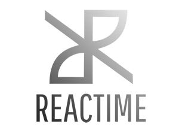
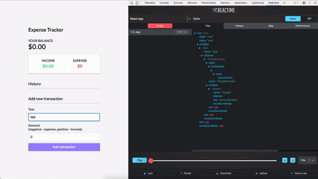

<h1 align="center">
   
    
     
     
  React Performance Tool
     
    <a href="https://osawards.com/react/"> Nominated for React Open Source Awards 2020 </a>
   
</h1>

<h4 align="center"> Reactime is a performance and debugging tool for React developers <b>(Beta version for Gatsby and Next.js)</b>. It records a snapshot whenever a target application's state is changed and allows the user to jump to any previously recorded state. It also detects the amount of renders of each component and average time of rendering.</h4>

 

  
    
    
    
    

<!--      -->

<h5 align="center">
 
  <a href="./README.rus.md">🇷🇺  &nbsp; РУССКАЯ ВЕРСИЯ</a> &nbsp; • &nbsp;  <a href="./README.fr.md">🇫🇷  &nbsp; VERSION FRANÇAISE</a>
   
</h5>
 

  <a href="#how-to-use">How To Use</a> • <a href="#features">Features</a> • <a href="https://reactime.io">Website</a> • <a href="#read-more">Read More</a>

Currently, Reactime supports React apps using stateful components and Hooks, with beta support for Recoil and Context API and frameworks like Gatsby and Next.js.

<b>Reactime version 11.0</b> implements full compatibility with React Hooks. Additionally, hover functionality was added to all of the nodes that populate in the history tab, allowing developers to more easily view the state at that snapshot.

Reactime 11.0 fixes existing bugs while also improving the user experience for information tooltips.

After installing Reactime, you can test its functionalities with your React application in development mode.

Please note, the time jumping feature will <b>ONLY</b> work when your application is running in <b>development mode</b>. In production mode, you are able to view your application’s component map but no additional features.

## <b>Installation</b>

To get started, install the Reactime [extension](https://chrome.google.com/webstore/detail/reactime/cgibknllccemdnfhfpmjhffpjfeidjga) from Chrome Web Store.

NOTE: The React Developer Tools [extension](https://chrome.google.com/webstore/detail/react-developer-tools/fmkadmapgofadopljbjfkapdkoienihi?hl=en) is also required for Reactime to run, if you do not already have it installed on your browser.

### <b>Alternative Installation</b>

Use `src/extension/build/build.zip` for manual installation in [Developer mode](https://developer.chrome.com/extensions/faq#faq-dev-01). Turn on 'Allow access to file URLs' in extension details page if testing locally.

## <b>How to Use</b>

After installing the Chrome extension, just open up your project in the browser.

Then open up your Chrome DevTools and navigate to the Reactime panel.

## <b>Troubleshooting</b>

### ❓ <b>Why is Reactime telling me that no React application is found?</b>

Reactime initially runs using the dev tools global hook from the Chrome API. It takes time for Chrome to load this. Try refreshing your application a couple times until you see Reactime running.

### ❓ <b>There is a black screen instead of the Reactime extension</b>

Try refreshing the application you want to test and refresh the DevTools by clicking the right mouse button “Reload frame”.

### ❓ <b>I found a bug in Reactime</b>

Reactime is an open source project, and we’d really appreciate your help with improving user experience. Please create a pull request (or issue) to propose and collaborate on changes to a repository.

## <b>Features</b>

### 🔹 Re-render Optimization

One of the most common issues that affects performance in React is unnecessary render cycles. This problem can be fixed by checking your renders in the Performance tab in Chrome DevTools under the Reactime panel.

### 🔹 Gatsby

Reactime offers fully support for Gatsby applications. You would be able to identify unnecessary renders, duration of each rendering, travel-debugging features and visual representation of the tree components.

### 🔹 Next.js

Reactime offers debugging and performance tools for Next.js apps: time-traveling debugging, preventing unnecessary components re-renders and making your application faster.

### 🔹 Recording

Whenever state is changed (whenever setState, useState is called), this extension will create a snapshot of the current state tree and record it. Each snapshot will be displayed in Chrome DevTools under the Reactime panel.

### 🔹 Snapshot Comparison 

You can save a series of state snapshots and use it to analyze changes in component render performance between current and previous series of snapshots.

 

### 🔹 Viewing

You can click on a snapshot to view your app's state. State can be visualized in a Component Graph, JSON Tree, or Performance Graph. Snapshots can be diffed with the previous snapshot, which can be viewed in Diff mode.

### 🔹 Jumping

Using the actions sidebar, a user can jump to any previous recorded snapshots. Hitting the jump button on any snapshot will allow a user to view state data at any point in the history of the target application.

### 🔹 TypeScript Support

Reactime offers beta support for TypeScript applications using stateful class components and functional components. Further testing and development is required for custom hooks, Context API, and Concurrent Mode.

### 🔹 Documentation

After cloning this repository, developers can simply run `npm run docs` at the root level and serve the dynamically generated `/docs/index.html` file on a browser. Doing so will provide a readable, extensible, and interactive GUI view of the structure and interfaces of the codebase.
 

 

### <b>Additional Features</b>

- Identifying unnecessary re-renders
- Single-click to view tooltip details on state visualizations
- Double-click to collapse child components 
- A reverse filter with autofill to focus on a portion of the component map
- Ability to pan and zoom on state visualizations
- A dropdown to support development of projects on multiple tabs
- A slider to move through snapshots quickly
- A play button to move through snapshots automatically
- A lock button, which stops recording each snapshot
- A persist button to keep snapshots upon refresh (handy when changing code and debugging)
- Download/upload the current snapshots in memory
- Declarative titles in the actions sidebar

## <b>Read More</b>

- [Time-Travel State with Reactime](https://medium.com/better-programming/time-traveling-state-with-reactime-6-0-53fdc3ae2a20)
- [React Fiber and Reactime](https://medium.com/@aquinojardim/react-fiber-reactime-4-0-f200f02e7fa8)
- [Meet Reactime - a time-traveling State Debugger for React](https://medium.com/@yujinkay/meet-reactime-a-time-traveling-state-debugger-for-react-24f0fce96802)
- [Deep in Weeds with Reactime, Concurrent React_fiberRoot, and Browser History Caching](https://itnext.io/deep-in-the-weeds-with-reactime-concurrent-react-fiberroot-and-browser-history-caching-7ce9d7300abb)
- [Time-Traveling Through React State with Reactime 9.0](https://rxlina.medium.com/time-traveling-through-react-state-with-reactime-9-0-371dbdc99319)
- [What time is it? Reactime!](https://medium.com/@liuedar/what-time-is-it-reactime-fd7267b9eb89)

## <b>Authors</b>

- **Kris Sorensen** - [@kris-sorensen](https://github.com/kris-sorensen)
- **Daljit Gill** - [@dgill05](https://github.com/dgill05)
- **Ben Michareune** - [@bmichare](https://github.com/bmichare)
- **Dane Corpion** - [@danecorpion](https://github.com/danecorpion)
- **Harry Fox** - [@StackOverFlowWhereArtThou](https://github.com/StackOverFlowWhereArtThou)
- **Nathan Richardson** - [@BagelEnthusiast](https://github.com/BagelEnthusiast)
- **David Bernstein** - [@dangitbobbeh](https://github.com/dangitbobbeh)
- **Joseph Stern** - [@josephiswhere](https://github.com/josephiswhere)
- **Dennis Lopez** - [@DennisLpz](https://github.com/DennisLpz)
- **Cole Styron** - [@colestyron](https://github.com/C-STYR)
- **Ali Rahman** - [@CourageWolf](https://github.com/CourageWolf)
- **Caner Demir** - [@demircaner](https://github.com/demircaner)
- **Kevin Ngo** - [@kev-ngo](https://github.com/kev-ngo)
- **Becca Viner** - [@rtviner](https://github.com/rtviner)
- **Caitlin Chan** - [@caitlinchan23](https://github.com/caitlinchan23)
- **Kim Mai Nguyen** - [@Nkmai](https://github.com/Nkmai)
- **Tania Lind** - [@lind-tania](https://github.com/lind-tania)
- **Alex Landeros** - [@AlexanderLanderos](https://github.com/AlexanderLanderos)
- **Chris Guizzetti** - [@guizzettic](https://github.com/guizzettic)
- **Jason Victor** - [@theqwertypusher](https://github.com/Theqwertypusher)
- **Sanjay Lavingia** - [@sanjaylavingia](https://github.com/sanjaylavingia)
- **Vincent Nguyen** - [@VNguyenCode](https://github.com/VNguyenCode)
- **Haejin Jo** - [@haejinjo](https://github.com/haejinjo)
- **Hien Nguyen** - [@hienqn](https://github.com/hienqn)
- **Jack Crish** - [@JackC27](https://github.com/JackC27)
- **Kevin Fey** - [@kevinfey](https://github.com/kevinfey)
- **Carlos Perez** - [@crperezt](https://github.com/crperezt)
- **Edwin Menendez** - [@edwinjmenendez](https://github.com/edwinjmenendez)
- **Gabriela Jardim Aquino** - [@aquinojardim](https://github.com/aquinojardim)
- **Greg Panciera** - [@gpanciera](https://github.com/gpanciera)
- **Nathanael Wa Mwenze** - [@nmwenz90](https://github.com/nmwenz90)
- **Ryan Dang** - [@rydang](https://github.com/rydang)
- **Bryan Lee** - [@mylee1995](https://github.com/mylee1995)
- **Josh Kim** - [@joshua0308](https://github.com/joshua0308)
- **Sierra Swaby** - [@starkspark](https://github.com/starkspark)
- **Ruth Anam** - [@peachiecodes](https://github.com/peachiecodes)
- **David Chai** - [@davidchaidev](https://github.com/davidchai717)
- **Yujin Kang** - [@yujinkay](https://github.com/yujinkay)
- **Andy Wong** - [@andywongdev](https://github.com/andywongdev)
- **Chris Flannery** - [@chriswillsflannery](https://github.com/chriswillsflannery)
- **Rajeeb Banstola** - [@rajeebthegreat](https://github.com/rajeebthegreat)
- **Prasanna Malla** - [@prasmalla](https://github.com/prasmalla)
- **Rocky Lin** - [@rocky9413](https://github.com/rocky9413)
- **Abaas Khorrami** - [@dubalol](https://github.com/dubalol)
- **Ergi Shehu** - [@Ergi516](https://github.com/ergi516)
- **Raymond Kwan** - [@rkwn](https://github.com/rkwn)
- **Joshua Howard** - [@Joshua-Howard](https://github.com/joshua-howard)
- **Lina Shin** - [@rxlina](https://github.com/rxlina)
- **Andy Tsou** - [@andytsou19](https://github.com/andytsou19)
- **Feiyi Wu** - [@FreyaWu](https://github.com/FreyaWu)
- **Viet Nguyen** - [@vnguyen95](https://github.com/vnguyen95)
- **Alex Gomez** - [@alexgomez9](https://github.com/alexgomez9)
- **Edar Liu** - [@liuedar](https://github.com/liuedar)
- **Kristina Wallen** - [@kristinawallen](https://github.com/kristinawallen)
- **Quan Le** - [@blachfog](https://github.com/Blachfog)
- **Robert Maeda** - [@robmaeda](https://github.com/robmaeda)

## <b>License </b>

This project is licensed under the MIT License - see the [LICENSE](LICENSE) file for details