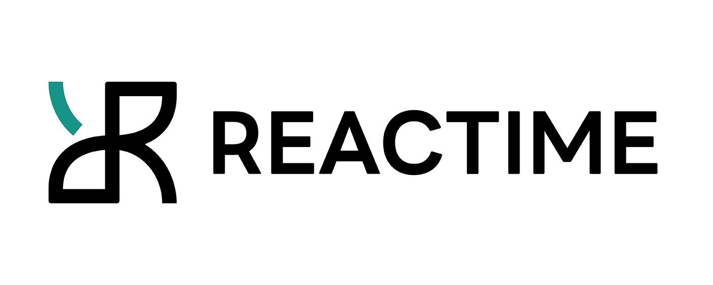

<h1 align="center">
    
  React Performance Tool
     
    <a href="https://osawards.com/react/">🏆 Nominated for React Open Source Awards 2020</a>
   
</h1>

<h4 align="center">A powerful Chrome extension that enhances React development with time-travel debugging and advanced performance monitoring</h4>
 

  
  
  

<h5 align="center">
 
  <a href="./README.rus.md">🇷🇺  &nbsp; РУССКАЯ ВЕРСИЯ</a> &nbsp; • &nbsp;  <a href="./README.fr.md">🇫🇷  &nbsp; VERSION FRANÇAISE</a> &nbsp; • &nbsp; <a href='./src/DEVELOPER_README.md'>👩‍💻 Developer README</a>
   
</h5>
 

## <h1>✨ Key Features</h1>

### 🔍 State Visualization

- **SMultiple Views**: Visualize your application state through Component Graphs, JSON Trees, Performance Graphs, and Accessibility Trees
- **SHistory Timeline**: Track state changes over time with an intuitive history visualization
- **SWeb Metrics**: Monitor critical performance metrics in real-time
- **SAccessibility Insights**: Analyze your app's accessibility tree for each state change
   

On the main page, there are two main selections from the dropdown panel:

- **STimejump**: View and navigate through the snapshot history of your application's state. You can jump to any point in time to see how the state evolves across changes. You can also use the play button to replay each state change automatically.
- **SProviders / Consumers**: Understand your application's context dependencies and their interactions better through visualizing its provider and consumer relationships.
   

 

### ⏱️ Time-Travel Debugging

- **State Snapshots**: Capture and navigate through your application's state history
- **Playback Controls**: Automatically replay state changes with adjustable speed
- **Jump Points**: Instantly navigate to any previous state
- **Diff Comparisons**: Compare states between snapshots
   

 

### 📊 Performance Analysis

- **Component Metrics**: Track render times and performance bottlenecks
- **Series Comparison**: Compare performance across different sets of state changes
- **Re-render Detection**: Identify and fix unnecessary render cycles
- **Web Vitals**: Monitor Core Web Vitals and other performance metrics
   

### 🔄 Modern Framework Support

<ul>
  <li>
    Full compatibility with <strong>Gatsby, Next.js, and Remix</strong>
  </li>
    <li>
TypeScript support for class and functional components
  </li>
    <li>
Support for React Hooks and Context API
  </li>
  </ul>
   

### 💾 State Persistence & Sharing

Reactime makes it easy to save and share your application's state history:

- **Export State History**: Save your recorded snapshots as a JSON file for later analysis or sharing
- **Import Previous Sessions**: Upload previously saved snapshots to compare state changes across different sessions
- **Cross-Session Analysis**: Compare performance and state changes between different development sessions
   

 

### 📚 Interactive Documentation

Reactime provides comprehensive documentation to help developers understand its architecture and APIs:
After cloning this repository, developers can simply run `npm run docs` at the
root level and serve the dynamically generated `/docs/index.html` provding:

<ul>
  <li>
  Interactive component diagrams
  </li>
    <li>
Type definitions and interfaces
  </li>
    <li>
Codebase architecture overview
  </li>
      <li>
API references and examples
  </li>
  </ul>
   

<h1>🎉 What's New!</h1>

Reactime 26.0 brings a complete overhaul to the React debugging experience, featuring:

- **New Context Data Display**

  - First-ever visualization of useContext hook state changes
  - Clear mapping of provider-consumer relationships
  - Real-time context state value monitoring
  - Detailed provider data visualization

- **Enhanced Time Travel Debugging**

  - Redesigned slider interface positioned alongside snapshots
  - Variable playback speed controls
  - More intuitive state navigation
  - Improved snapshot visualization

- **Modern UI Overhaul**

  - Sleek, contemporary design with rounded components
  - Intuitive layout improvements
  - New dark mode support
  - Enhanced visual hierarchy

- **Major Technical Improvements**
  - Fixed connection persistence during idle time and tab switches
  - Restored accessibility tree visualization
  - Resolved state capture issues for function-based useState hooks
  - Improved overall extension reliability and performance

These updates make Reactime more powerful, reliable, and user-friendly than ever before, setting a new standard for React debugging tools.

If you would like to read more about previous releases, click <a href="https://github.com/open-source-labs/reactime/releases">here!</a>

<h1>🚀 Getting Started</h1>

### Installation

1. Install the [Reactime extension](https://chrome.google.com/webstore/detail/reactime/cgibknllccemdnfhfpmjhffpjfeidjga) from the Chrome Web Store
2. Install the required [React Developer Tools](https://chrome.google.com/webstore/detail/react-developer-tools/fmkadmapgofadopljbjfkapdkoienihi?hl=en) extension if you haven't already

### Prerequisites

- Your React application must be running in **development mode**
- React Developer Tools extension must be installed
- Chrome browser (version 80 or higher recommended)

### Launch Reactime

There are two ways to open the Reactime panel:

1. **Context Menu**

   - Right-click anywhere on your React application
   - Select "Reactime" from the context menu

2. **DevTools**
   - Open Chrome DevTools (F12 or ⌘+⌥+I)
   - Navigate to the "Reactime" tab

Once launched, Reactime will automatically begin monitoring your application's state changes and performance metrics.

### Looking to contribute to Reactime?

<i>Please refer to Developer Install for a detailed guide:</i>

Refer to the <a href='./src/DEVELOPER_README.md'>👩‍💻 Developer README</a> for more info on the project, and
instructions on building from source.

## <b>Troubleshooting</b>

### ❓ <b>Why is Reactime not recording new state changes?</b>

Reactime lost its connection to the tab you're monitoring, simply click the "reconnect" button to resume your work.

### ❓ <b>Why is Reactime telling me that no React application is found?</b>

Reactime initially runs using the dev tools global hook from the Chrome API. It
takes time for Chrome to load this. Try refreshing your application a couple of
times until you see Reactime running.

### ❓ <b>Why do I need to have React Dev Tools enabled?</b>

Reactime works in tandem with the React Developer Tools to access a React application's Fiber tree; under the hood, Reactime traverses the Fiber tree through the React Developer Tool's global hook, pulling all relevant information needed to display to the developer

### ❓ <b>I found a bug in Reactime</b>

Reactime is an open-source project, and we'd love to hear from you about
improving the user experience. Please read <a href='./src/DEVELOPER_README.md'>👩‍💻 Developer README</a>,
and create a pull request (or issue) to propose and collaborate on changes to Reactime.

### ❓ <b>Node version compatibility</b>

With the release of Node v18.12.1(LTS) on 11/4/22, the script has been updated to
'npm run dev' | 'npm run build' for backwards compatibility.  For version
Node v16.16.0, please use script 'npm run devlegacy' | 'npm run buildlegacy'

## <b>Authors</b>

- **Garrett Chow** - [@garrettlchow](https://github.com/garrettlchow)
- **Ellie Simens** - [@elliesimens](https://github.com/elliesimens)
- **Ragad Mohammed** - [@ragad-mohammed](https://github.com/ragad-mohammed)
- **Daniel Ryczek** - [@dryczek14](https://github.com/dryczek01)
- **Patrice Pinardo** - [@pinardo88](https://github.com/pinardo88)
- **Haider Ali** - [@hali03](https://github.com/hali03)
- **Jose Luis Sanchez** - [@JoseSanchez1996](https://github.com/JoseSanchez1996)
- **Logan Nelsen** - [@ljn16](https://github.com/ljn16)
- **Mel Koppens** - [@MelKoppens](https://github.com/MelKoppens)
- **Amy Yang** - [@ay7991](https://github.com/ay7991)
- **Eva Ury** - [@evaSUry](https://github.com/evaSUry)
- **Jesse Guerrero** - [@jguerrero35](https://github.com/jguerrero35)
- **Oliver Cho** - [@Oliver-Cho](https://github.com/Oliver-Cho)
- **Ben Margolius** - [@benmarg](https://github.com/benmarg)
- **Eric Yun** - [@ericsngyun](https://github.com/ericsngyun)
- **James Nghiem** - [@jemzir](https://github.com/jemzir)
- **Wilton Lee** - [@wiltonlee948](https://github.com/wiltonlee948)
- **Louis Lam** - [@llam722](https://github.com/llam722)
- **Samuel Tran** - [@leumastr](https://github.com/leumastr)
- **Brian Yang** - [@yangbrian310](https://github.com/yangbrian310)
- **Emin Tahirov** - [@eminthrv](https://github.com/eminthrv)
- **Peng Dong** - [@d28601581](https://github.com/d28601581)
- **Ozair Ghulam** - [@ozairgh](https://github.com/ozairgh)
- **Christina Or** - [@christinaor](https://github.com/christinaor)
- **Khanh Bui** - [@AndyB909](https://github.com/AndyB909)
- **David Kim** - [@codejunkie7](https://github.com/codejunkie7)
- **Robby Tipton** - [@RobbyTipton](https://github.com/RobbyTipton)
- **Kevin HoEun Lee** - [@khobread](https://github.com/khobread)
- **Christopher LeBrett** - [@fscgolden](https://github.com/fscgolden)
- **Joseph Park** - [@joeepark](https://github.com/joeepark)
- **Kris Sorensen** - [@kris-sorensen](https://github.com/kris-sorensen)
- **Daljit Gill** - [@dgill05](https://github.com/dgill05)
- **Ben Michareune** - [@bmichare](https://github.com/bmichare)
- **Dane Corpion** - [@danecorpion](https://github.com/danecorpion)
- **Harry Fox** -
  [@StackOverFlowWhereArtThou](https://github.com/StackOverFlowWhereArtThou)
- **Nathan Richardson** - [@BagelEnthusiast](https://github.com/BagelEnthusiast)
- **David Bernstein** - [@dangitbobbeh](https://github.com/dangitbobbeh)
- **Joseph Stern** - [@josephiswhere](https://github.com/josephiswhere)
- **Dennis Lopez** - [@DennisLpz](https://github.com/DennisLpz)
- **Cole Styron** - [@colestyron](https://github.com/C-STYR)
- **Ali Rahman** - [@CourageWolf](https://github.com/CourageWolf)
- **Caner Demir** - [@demircaner](https://github.com/demircaner)
- **Kevin Ngo** - [@kev-ngo](https://github.com/kev-ngo)
- **Becca Viner** - [@rtviner](https://github.com/rtviner)
- **Caitlin Chan** - [@caitlinchan23](https://github.com/caitlinchan23)
- **Kim Mai Nguyen** - [@Nkmai](https://github.com/Nkmai)
- **Tania Lind** - [@lind-tania](https://github.com/lind-tania)
- **Alex Landeros** - [@AlexanderLanderos](https://github.com/AlexanderLanderos)
- **Chris Guizzetti** - [@guizzettic](https://github.com/guizzettic)
- **Jason Victor** - [@theqwertypusher](https://github.com/Theqwertypusher)
- **Sanjay Lavingia** - [@sanjaylavingia](https://github.com/sanjaylavingia)
- **Vincent Nguyen** - [@VNguyenCode](https://github.com/VNguyenCode)
- **Haejin Jo** - [@haejinjo](https://github.com/haejinjo)
- **Hien Nguyen** - [@hienqn](https://github.com/hienqn)
- **Jack Crish** - [@JackC27](https://github.com/JackC27)
- **Kevin Fey** - [@kevinfey](https://github.com/kevinfey)
- **Carlos Perez** - [@crperezt](https://github.com/crperezt)
- **Edwin Menendez** - [@edwinjmenendez](https://github.com/edwinjmenendez)
- **Gabriela Jardim Aquino** - [@aquinojardim](https://github.com/aquinojardim)
- **Greg Panciera** - [@gpanciera](https://github.com/gpanciera)
- **Nathanael Wa Mwenze** - [@nmwenz90](https://github.com/nmwenz90)
- **Ryan Dang** - [@rydang](https://github.com/rydang)
- **Bryan Lee** - [@mylee1995](https://github.com/mylee1995)
- **Josh Kim** - [@joshua0308](https://github.com/joshua0308)
- **Sierra Swaby** - [@starkspark](https://github.com/starkspark)
- **Ruth Anam** - [@nusanam](https://github.com/nusanam)
- **David Chai** - [@davidchaidev](https://github.com/davidchai717)
- **Yujin Kang** - [@yujinkay](https://github.com/yujinkay)
- **Andy Wong** - [@andynullwong](https://github.com/andynullwong)
- **Chris Flannery** -
  [@chriswillsflannery](https://github.com/chriswillsflannery)
- **Rajeeb Banstola** - [@rajeebthegreat](https://github.com/rajeebthegreat)
- **Prasanna Malla** - [@prasmalla](https://github.com/prasmalla)
- **Rocky Lin** - [@rocky9413](https://github.com/rocky9413)
- **Abaas Khorrami** - [@dubalol](https://github.com/dubalol)
- **Ergi Shehu** - [@Ergi516](https://github.com/ergi516)
- **Raymond Kwan** - [@rkwn](https://github.com/rkwn)
- **Joshua Howard** - [@Joshua-Howard](https://github.com/joshua-howard)
- **Lina Shin** - [@rxlina](https://github.com/rxlina)
- **Andy Tsou** - [@andytsou19](https://github.com/andytsou19)
- **Feiyi Wu** - [@FreyaWu](https://github.com/FreyaWu)
- **Viet Nguyen** - [@vnguyen95](https://github.com/vnguyen95)
- **Alex Gomez** - [@alexgomez9](https://github.com/alexgomez9)
- **Edar Liu** - [@liuedar](https://github.com/liuedar)
- **Kristina Wallen** - [@kristinawallen](https://github.com/kristinawallen)
- **Quan Le** - [@blachfog](https://github.com/Blachfog)
- **Robert Maeda** - [@robmaeda](https://github.com/robmaeda)
- **Lance Ziegler** - [@lanceziegler](https://github.com/lanceziegler)
- **Ngoc Zwolinski** - [@ngoczwolinski](https://github.com/ngoczwolinski)
- **Peter Lam** - [@dev-plam](https://github.com/dev-plam)
- **Zachary Freeman** - [@zacharydfreeman](https://github.com/zacharydfreeman/)
- **Jackie Yuan** - [@yuanjackie1](https://github.com/yuanjackie1)
- **Jasmine Noor** - [@jasnoo](https://github.com/jasnoo)
- **Minzo Kim** - [@minzo-kim](https://github.com/minzo-kim)
- **Mark Teets** - [@MarkTeets](https://github.com/MarkTeets)
- **Nick Huemmer** - [@NickHuemmer](https://github.com/ElDuke717)
- **James McCollough** - [@j-mccoll](https://github.com/j-mccoll)
- **Mike Bednarz** - [@mikebednarz](https://github.com/mikebednarz)
- **Sergei Liubchenko** - [@sergeylvq](https://github.com/sergeylvq)
- **Yididia Ketema** - [@yididiaketema](https://github.com/yididiaketema)
- **Morah Geist** - [@morahgeist](https://github.com/morahgeist)
- **Eivind Del Fierro** - [@EivindDelFierro](https://github.com/EivindDelFierro)
- **Kyle Bell** - [@KyEBell](https://github.com/KyEBell)
- **Sean Kelly** - [@brok3turtl3](https://github.com/brok3turtl3)
- **Christopher Stamper** - [@ctstamper](https://github.com/ctstamper)
- **Jimmy Phy** - [@jimmally](https://github.com/jimmally)
- **Andrew Byun** - [@AndrewByun](https://github.com/AndrewByun)
- **Kelvin Mirhan** - [@kelvinmirhan](https://github.com/kelvinmirhan)
- **Jesse Rosengrant** - [@jrosengrant](https://github.com/jrosengrant)
- **Liam Donaher** - [@leebology](https://github.com/leebology)
- **David Moore** - [@Solodt55](https://github.com/Solodt55)
- **John Banks** - [@Jbanks123](https://github.com/Jbanks123)

## <b>License </b>

This project is licensed under the MIT License - see the [LICENSE](LICENSE) file
for details.
