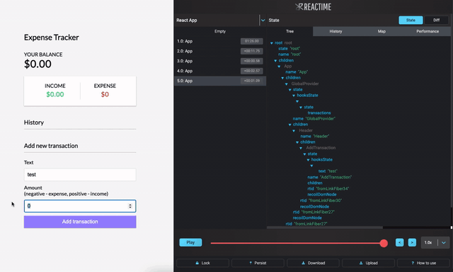

  

<h1 align="center">
  Отладка стейтов для приложений React

   Номинирован на премию 
   <a href="https://osawards.com/react/">React Open Source Awards 2020</a>
</h1>

    

<b>Reactime</b> - расширение для дебаггинга/отладки React приложений. Оно создает снэпшоты при каждом изменении состояния (state) и позволяет пользованию прыгать на любое предыдущее состояние (state). 
В настоящее время Reactime поддерживает React приложения с классовыми, функциональными компонентами, хуками и Context API.

В Reactime версии 7.0 отлажены баги предыдущих версий, улучшена визуализация данных отношений между компонентами. Также новая версия включает в себя  расширенную документацию для разработчиков, которые хотят работать над приложением. 

После загрузки Reactime вы можете протестировать его полную функциональность на любом вашем React приложении в режиме разработки (dev mode). В продакшен режиме вы можете только работать с картой компонентов.

## <b>Установка</b>

Для начала использования приложения, скачайте Reactime [extension](https://chrome.google.com/webstore/detail/reactime/cgibknllccemdnfhfpmjhffpjfeidjga) из Chrome Web Store. 

Внимание: Вам понадобится React Developer Tools [extension](https://chrome.google.com/webstore/detail/react-developer-tools/fmkadmapgofadopljbjfkapdkoienihi?hl=en) Вам не нужно запускать React DevTools, но расширение должно быть установлено в вашем браузере.

### <b>Альтернативная установка</b>
Используйте `src/extension/build/build.zip` для мануальной установки в [Developer mode](https://developer.chrome.com/extensions/faq#faq-dev-01). Включите 'Allow access to file URLs' в разделе с расширениями.

## <b>Как использовать</b>

После установки Chrome extension, просто откройте ваш проект в браузере.

Затем откройте Chrome DevTools и найдите панель Reactime.

## <b>Устраняем проблемы</b>

### <b>Почему Reactime говорит, что приложение React не найдено?</b>
Reactime работает при использовании глобального хука DevTools, его загрузка может занимать некоторое время у Chrome браузера. Попробуйте обновить ваше приложение.

### <b>Вместо Reactime - черный экран </b> 
Попробуйте обновить приложение, которые вы хотите отладить или обновите панель Reactime. Сделать это можно кликом правой кнопки “Reload the frame”.  

### <b>Я нашел ошибки при работе Reactime</b>
Reactime это open source project, поэтому мы будем рады, если вы поможете нам сделать его лучше. Если вы знаете как устранить баг - запросите pull request. Также вы можете сообщить об ошибках в разделе “Issues”. 

## <b>Функциональность</b>

### Оптимизация рендеринга
Одна из самых распространенных проблем, которая влияет на производительность приложения React - ненужный циклы ре-рендеринга. Эту проблему вы можете решить при помощи отслеживания рендеринга во вкладке Performance в Reactime. 

### Запись

Когда изменяется состояние (при вызове useState или setState), Reactime создает снэпшот состояния дерева в настоящий момент и записывает его. Каждый снэпшот отображается в Chrome DevTools в разделе Reactime.

### Просмотр

При клике на снапшот вы можете увидеть состояние вашего приложения. Состояния отображаются в виде графика или JSON дерева, вы можете переключить вкладку на удобную вам визуализацию. 

### Прыжки

Используя панель действий, вы можете совершать прыжки на предыдущие сохраненные снэпшоты. Используя данный функционал вы можете отследить работу приложения в нужный момент времени или при вводе определенных данных.

### TypeScript поддержка

Reactime beta поддерживает приложения, написанные на TypeScript, которые используют классы и функциональные компоненты.  Работа с хуками, Context API и  Concurrent Mode находится в стадии тестирования.

### Документация

После клонирования репозитория, вы можете использовать команду `npm run docs` в корневой папке, которая генерирует файл в браузере `/docs/index.html`. Это упростит знакомство с приложением и поможет вам ознакомиться со структурой и интерфейсом существующего кода. 

### <b>Дополнительный функционал</b>

- identifying unnecessary re-renders 
- hover functionality to view tooltip details on state visualizations
- ability to pan and zoom on state visualizations
- a dropdown to support development of projects on multiple tabs
- a slider to move through snapshots quickly
- a play button to move through snapshots automatically
- a lock button, which stops recording each snapshot
- a persist button to keep snapshots upon refresh (handy when changing code and debugging)
- download/upload the current snapshots in memory
- declarative titles in the actions sidebar

## <b>Узнать больше о Reactime и React Fiber</b>
- [Time-Travel State with Reactime](https://medium.com/better-programming/time-traveling-state-with-reactime-6-0-53fdc3ae2a20)
- [React Fiber and Reactime](https://medium.com/@aquinojardim/react-fiber-reactime-4-0-f200f02e7fa8)
- [Meet Reactime - a time-traveling State Debugger for React](https://medium.com/@yujinkay/meet-reactime-a-time-traveling-state-debugger-for-react-24f0fce96802)
- [Deep in Weeds with Reactime, Concurrent React_fiberRoot, and Browser History Caching](https://itnext.io/deep-in-the-weeds-with-reactime-concurrent-react-fiberroot-and-browser-history-caching-7ce9d7300abb)

## <b>Авторы</b>
- **Becca Viner** - [@rtviner](https://github.com/rtviner)
- **Caitlin Chan** - [@caitlinchan23](https://github.com/caitlinchan23)
- **Kim Mai Nguyen** - [@Nkmai](https://github.com/Nkmai)
- **Tania Lind** - [@lind-tania](https://github.com/lind-tania)
- **Alex Landeros** - [@AlexanderLanderos](https://github.com/AlexanderLanderos)
- **Chris Guizzetti** - [@guizzettic](https://github.com/guizzettic)
- **Jason Victor** - [@theqwertypusher](https://github.com/Theqwertypusher)
- **Sanjay Lavingia** - [@sanjaylavingia](https://github.com/sanjaylavingia)
- **Vincent Nguyen** - [@guizzettic](https://github.com/VNguyenCode)
- **Haejin Jo** - [@haejinjo](https://github.com/haejinjo)
- **Hien Nguyen** - [@hienqn](https://github.com/hienqn)
- **Jack Crish** - [@JackC27](https://github.com/JackC27)
- **Kevin Fey** - [@kevinfey](https://github.com/kevinfey)
- **Carlos Perez** - [@crperezt](https://github.com/crperezt)
- **Edwin Menendez** - [@edwinjmenendez](https://github.com/edwinjmenendez)
- **Gabriela Jardim Aquino** - [@aquinojardim](https://github.com/aquinojardim)
- **Greg Panciera** - [@gpanciera](https://github.com/gpanciera)
- **Nathanael Wa Mwenze** - [@nmwenz90](https://github.com/nmwenz90)
- **Ryan Dang** - [@rydang](https://github.com/rydang)
- **Bryan Lee** - [@mylee1995](https://github.com/mylee1995)
- **Josh Kim** - [@joshua0308](https://github.com/joshua0308)
- **Sierra Swaby** - [@starkspark](https://github.com/starkspark)
- **Ruth Anam** - [@peachiecodes](https://github.com/peachiecodes)
- **David Chai** - [@davidchaidev](https://github.com/davidchai717)
- **Yujin Kang** - [@yujinkay](https://github.com/yujinkay)
- **Andy Wong** - [@andywongdev](https://github.com/andywongdev)
- **Chris Flannery** - [@chriswillsflannery](https://github.com/chriswillsflannery)
- **Rajeeb Banstola** - [@rajeebthegreat](https://github.com/rajeebthegreat)
- **Prasanna Malla** - [@prasmalla](https://github.com/prasmalla)
- **Rocky Lin** - [@rocky9413](https://github.com/rocky9413)
- **Abaas Khorrami** - [@dubalol](https://github.com/dubalol)
- **Ergi Shehu** - [@Ergi516](https://github.com/ergi516)
- **Raymond Kwan** - [@rkwn](https://github.com/rkwn)
- **Joshua Howard** - [@Joshua-Howard](https://github.com/joshua-howard)

## <b>License </b>

This project is licensed under the MIT License - see the [LICENSE](LICENSE) file for details

