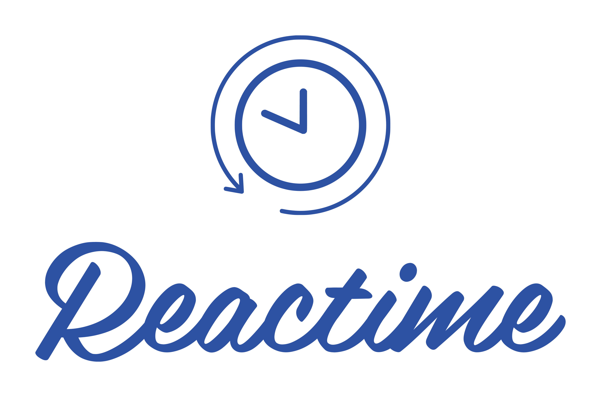
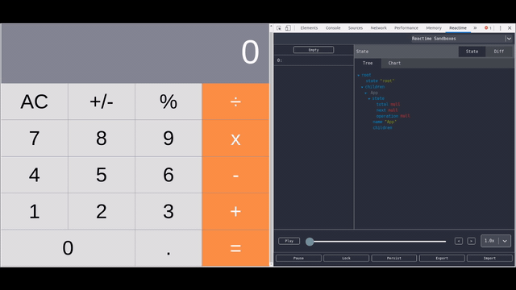

<p align="center">
  
</p>

# Reactime: A Time Travel Debugger for React

[](https://github.com/oslabs-beta/reactime)
[](https://travis-ci.com/oslabs-beta/reactime)
[](http://badge.fury.io/js/reactime)
[](https://david-dm.org/oslabs-beta/reactime#info=dependencies)
[](https://david-dm.org/oslabs-beta/reactime?type=dev)
[](https://snyk.io/test/github/oslabs-beta/reactime)

[](https://nodei.co/npm/reactime/)

<p align="center">
  
</p>

Reactime is a debugging tool for React developers. It records state whenever state is changed and allows user to jump to any previous recorded state.

One important thing to note. This devtool is for React apps using only stateful components and prop drilling. If you're using Redux, Hooks, Context, or functional components, this devtool will not function on your app. 

Another thing is that this library does not work well when mixing React with direct DOM manipulation. Since DOM manipulation doesn't change any React state, this library cannot record or even detect that change. Of course, you should be avoiding mixing the two in the first place.

Two parts are needed for this tool to function. The <a href="https://chrome.google.com/webstore/detail/react-time-travel/cgibknllccemdnfhfpmjhffpjfeidjga">chrome extension</a> must be installed, and the NPM package must be installed and used in the React code.

After successfully installing the chrome extension, you can test Reactime functionalities in the demo repositories below.

- <a href="http://reactime-demo1.us-east-1.elasticbeanstalk.com/">Calculator</a>
- <a href="http://reactime-demo2.us-east-1.elasticbeanstalk.com/">Bitcoin Price Index</a>

## Installing

1. Download the [extension](https://chrome.google.com/webstore/detail/reactime/cgibknllccemdnfhfpmjhffpjfeidjga) from Chrome Web Store.

2. Install the [npm package](https://www.npmjs.com/package/reactime) in your code.

```
npm i reactime
```

3. Call the library method on your root container after rendering your App.

```
const reactime = require('reactime');

const rootContainer = document.getElementById('root');
ReactDOM.render(<App />, rootContainer);

reactime(rootContainer);
```

4. Done! That's all you have to do to link your React project to our library.

## How to Use

After installing both the Chrome extension and the npm package, just open up your project in the browser.

Then open up your Chrome DevTools. There'll be a new tab called Reactime.

## Features

### Recording

Whenever state is changed (whenever setState is called), this extension will create a snapshot of the current state tree and record it. Each snapshot will be displayed in Chrome DevTools under the Reactime panel.

### Viewing

You can click on a snapshot to view your app's state. State can be visualized in a JSON or a tree. Also, snapshots can be diffed with the previous snapshot, which can be viewed under the Diff tab.

### Jumping

Jumping is the most important feature of all. It allows you to jump to any previous recorded snapshots. Hitting the jump button on any snapshot will change the DOM by setting their state.

### Others

Other handy features include:

- multiple tabs support
- a slider to move through snapshots quickly
- a play button to move through snapshots automatically
- a pause which button stops recording each snapshot
- a lock button to freeze the DOM in place. setState will lose all functionality while the extension is locked
- a persist button to keep snapshots upon refresh (handy when changing code and debugging)
- export/import the current snapshots in memory

## Authors

- **Ryan Dang** - [@rydang](https://github.com/rydang)
- **Bryan Lee** - [@mylee1995](https://github.com/mylee1995)
- **Josh Kim** - [@joshua0308](https://github.com/joshua0308)
- **Sierra Swaby** - [@starkspark](https://github.com/starkspark)
- **Ruth Anam** - [@peachiecodes](https://github.com/peachiecodes)
- **David Chai** - [@davidchaidev](https://github.com/davidchaidev)
- **Yujin Kang** - [@yujinkay](https://github.com/yujinkay)
- **Andy Wong** - [@andywongdev](https://github.com/andywongdev)

## License

This project is licensed under the MIT License - see the [LICENSE](LICENSE) file for details
