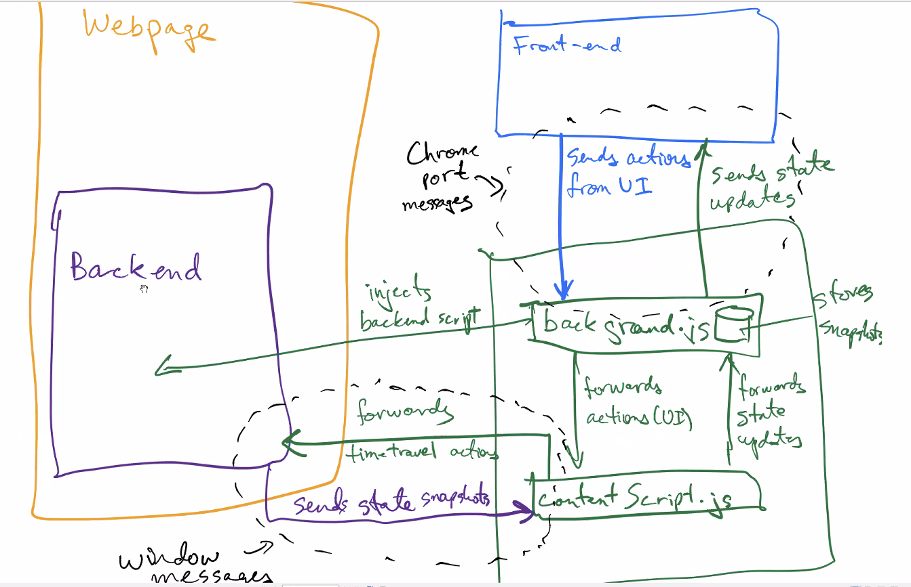

This documentation explains the architecture of Reactime v4.

In the src folder, there are three directory: app, backend, and extension. 

The app folder is responsible a SPA application that you see when you open the chrome dev tools under the reactime tab. 

The backend folder is responsible for generating data and handle time jump request from the background.js scripts in extension. 

The extension folder is where the contentscript.js and background.js located. These two files belongs to Chrome internal to help us handle requests both from the web browser and from the chrome dev tools. Unsure what contentscripts and backgroundscripts are? The details implementation are documented in the files themselves. 

> Content scripts are files that run in the context of web pages. By using the standard Document Object Model (DOM), they are able to read details of the web pages the browser visits, make changes to them and pass information to their parent extension. Source: https://developer.chrome.com/extensions/content_scripts

>A background page is loaded when it is needed, and unloaded when it goes idle. Some examples of events include:
>The extension is first installed or updated to a new version.
>The background page was listening for an event, and the event is dispatched.
>A content script or other extension sends a message.
>Another view in the extension, such as a popup, calls runtime.getBackgroundPage.
>Once it has been loaded, a background page will stay running as long as it is performing an action, such as calling a Chrome API or issuing a network request. Additionally, the background page will not unload until all visible views and all message ports are closed. Note that opening a view does not cause the event page to load, but only prevents it from closing once loaded. Source: https://developer.chrome.com/extensions/background_pages

Just to reiterate, contentscript is use to read and modify information that is rendered on the webpage, and a host of other objects. Background is very similar to client/server concept in which background is behaving like a server, listening to request from the contentscipt and **the request from the "front-end" of the chrome dev tools in the reactime tab (not the interface of the browser, this is an important distinction.)** In other words, background script works directly with the React Dev Tools, whereas contentscript works with the interface of the browser.

The general flow of data is described in the following steps:

1. When the background bundle is loaded from the browser, it injects a script into the dom. This script uses a technique called [throttle](https://medium.com/@bitupon.211/debounce-and-throttle-160affa5457b) to get the data of the state to send to the contentscript every specified miliseconds.

2. This contentscript always listens to the messages being sent from the interface of the browser. The recieved data will immediately be sent to the background script which then update an object that persist in background script called **tabsObj**. Each time tabsObj is updated, the most recent version will be sent to the interface of reactime dev tools written the app folder.

3. Likewise, when there is an action from Reactime dev tools - a jump request for example, a request will be made to the background script which is proxied to the content script. This content script will talk to the browser interface to request the *state* that the user wants to jump to. One important thing to note here is that the jump action will be excecuted in the backend script because it has direct access to the DOM.
