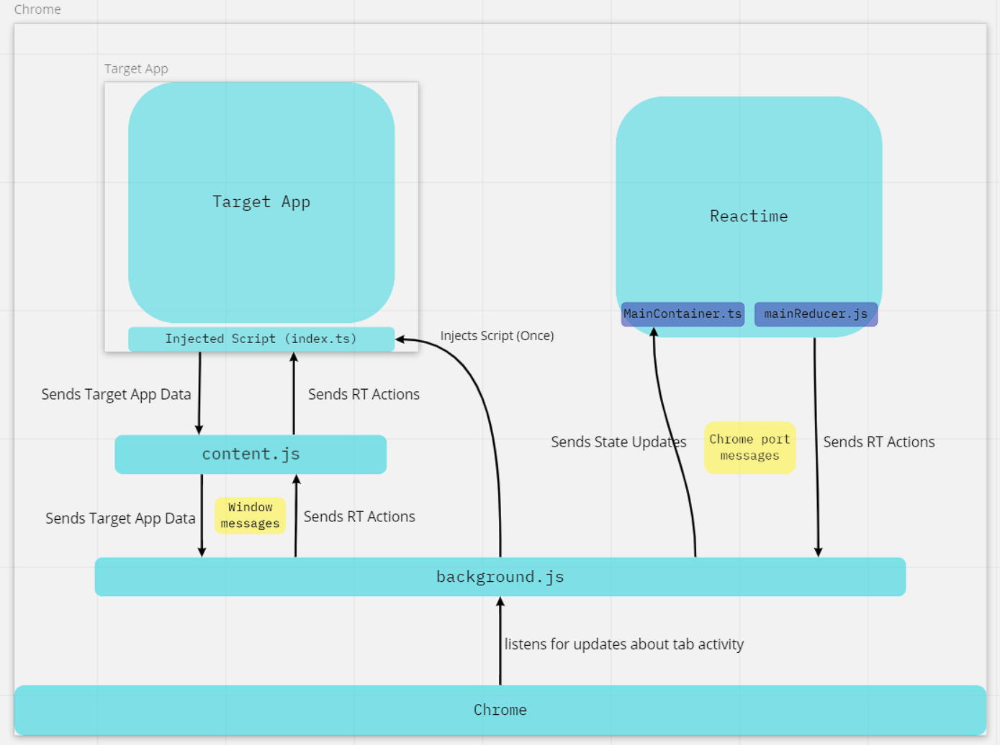

# Developer README

## Brief

Our mission at Reactime is to maintain and iterate constantly, but never at the expense of future developers.<br />We know how hard it is to quickly get up to speed and onboard in a new codebase.<br />So, here are some helpful pointers to help you hit the ground running. 🏃🏾💨

## Building from source

1. [Download]("https://chrome.google.com/webstore/detail/react-developer-tools/fmkadmapgofadopljbjfkapdkoienihi?hl=en") React Dev Tools from the Chrome Webstore Here

2. Clone down the Reactime repo onto your machine.

```
git clone https://github.com/open-source-labs/reactime.git
```

3. Install dependencies and build.

```
cd reactime
npm install --force
npm run dev
```

With release of Node v18.12.1 (LTS) on 11/4/22, the script has been updated to 'npm run dev' || 'npm run build' for backwards compatibility.<br/>
For version Node v16.16.0, please use script 'npm run devlegacy' || 'npm run buildlegacy'

4. Spin up the demo application.

```
cd demo-app
npm install
npm run dev
```

Similar approach for Next.js and Remix demo apps

5. Add Reactime to your Chrome extensions.

- Navigate to chrome://extensions
- Select “Load Unpacked”
- Choose reactime > src > extension > build
- Navigate to http://localhost:8080/ to inspect the demo application using Reactime!
  <br>

<p align="center">
  
</p>

## For Future Iterators 
Here are some notes on the current state of Reactime and considerations for future development.

<h2> Testing </h2>

For Reactime unit tests, pre-v.19 there were tests built out in two places. Backend tests were in backend >\__tests__. Frontend tests were in src > app >\__tests__. In v19, we specifically focused on rebuilding front tests to use React Testing Library (RTL) + Jest. Previously, front end testing existed but utilized Enzyme + Jest . Our decision to move to RTL stemmed on the fact that Enzyme did not support React V17 (third party Enzyme adaptor libraries were created to provide support to previous React versions, but were still very much out of date) and that Enzyme is no longer industry standard. We began the process of creating new frontend tests but they are not complete and this is a great place for future iterators to build out more. Since the new suite of RTL tests are not fully complete, we have kept the older Enzyme tests within the codebase to be referenced (src > app > __tests__enzyme). However, these will not be included in the tests run in the testing scripts.

## Including Support for Hooks Beyond useState
Reactime currently shows data stored via useState, but does not show data stored via other hooks such as useContext or useReducer. While showing this data would be simple, maintaining the time travel functionality of Reactime with these hooks would not. Please see file demo-app/src/client/Components/ButtonsWithMoreHooks.jsx for more details.

To see how hook data is stored in the fiber tree:

1. Change demo-app/src/client/Router.tsx to use utilize the ButtonsWithMoreHooks component
2. Have the “Load Unpacked” version of Reactime in your chrome extension.
3. Add console.logs in src/backend/routers/linkFiber.ts to log the fiber tree captured for a running app. In this case it'll be the demo-app
4. Run Reactime on your computer via "npm run dev", which links your local Reactime to the “Load Unpacked” chrome extension.
5. Run the demo-app from a separate terminal that's currently in the demo-app directory via "npm run dev"
6. Navigate through the fiber tree in the console until you find the tree node for demo-app/src/client/Components/IncrementWithMoreHooks.jsx to see hook data.

Any changes to console.logs in Reactime can be seen by refreshing the browser the app is running in.


## Redux

Can Reactime be integrated with Redux compatibility so applications using Redux can track state in Reactime?

Yes, but it would be very time-consuming and not the most feasible option while Redux devtools exists already. With how Redux devtools is currently set up, a developer is unable to use Redux devtools as a third-party user and integrate its functionality into their own application, as Redux devtools is meant to be used directly on an application using Redux for state-tracking purposes. Since the devtools do not appear to have a public API for integrated use in an application or it simply does not exist, Redux devtools would need to be rebuilt from the ground up and then integrated into Reactime, or built into Reactime directly still from scratch.


## Quick Tips

- _Before_ beginning development, especially on teams, make sure to configure your linter and code formatting to conform to one unified setting (We recommend [the Airbnb style guide](https://github.com/airbnb/javascript)!) This will make reviewing PRs much more readable and less error-prone.

- With release of Node v18.12.1 (LTS) on 11/4/22, the script has been updated to 'npm run dev' | 'npm run build' for backwards compatibility.<br/>
For version Node v16.16.0, please use script 'npm run devlegacy' | 'npm run buildlegacy'

# File Structure

In the _src_ folder, there are three directories we care about: _app_, _backend_, and _extension_.

```
src/
├── app/                          # Frontend code
│   ├── __tests__/                # React Testing Library
│   ├── __tests__enzyme/          # Legacy Enzyme tests
│   ├── actions/                  # Redux action creators
│   ├── components/               # React components
│   ├── constants/                #
│   ├── containers/               # More React components
│   ├── reducers/                 # Redux mechanism for updating state
│   ├── styles/                   #
│   ├── FrontendTypes.ts          # Library of typescript interfaces 
│   ├── index.tsx                 # Starting point for root App component
│   ├── module.d.ts               #
│   └── store.tsx                 #
│
├── backend/                      # "Backend" code (injected into target app)
│   │                             # Focus especially on linkFiber, timeJump, tree, and helpers
│   ├── __tests__/                #
│   ├── controllers/              #
│       ├── createComponentActionsRecord.ts # Update the componentActionsRecord with new bound state-update methods
│       ├── createTree.ts         # Construct a tree snapshot from the FiberRoot tree given by ReactFiber.
│       ├── statePropExtractor.ts # Helper functions to extract & format prop, state, and context data
│       ├── throttle.ts           #
│       ├── timeJump.ts           # Rerenders DOM based on snapshot from background script
│   ├── models/
│       ├── filterConditions.ts   #
│       ├── masterState.ts        # Component action record interface
│       ├── routes.ts             # Interfaces with the browser history stack
│       ├── tree.ts               # Custom structure to send to background
│   ├── routers/
│       ├── linkFiber.ts          # Check for all requirement to start Reactime and
│       ├── snapShot.ts           #
│   ├── types/                    # Typescript interfaces
│   ├── index.ts                  # Starting point for backend functionality
│   ├── index.d.ts                # Definitely Type file for Index
│   ├── module.d.ts               #
│   ├── package.json              #
│   ├── puppeteerServer.js        #
│
├── extension/                    # Chrome Extension code
│   ├── build/                    # Destination for bundles and manifest.json (Chrome config file)
│   │                             #
│   ├── background.js             # Chrome Background Script
│   └── contentScript.ts          # Chrome Content Script
└──
```

# Diagrams

All the diagrams of data flows are avaliable on [MIRO](https://miro.com/app/board/uXjVPictrsM=/)

1. The _app_ folder is responsible for the Single Page Application that you see when you open the chrome dev tools under the Reactime tab.


2. The _backend_ folder contains the set of all scripts that we inject into our "target" application via `background.js`
   - In Reactime, its main role is to generate data and handle time-jump requests from the background script in our _extension_ folder.


3. The _extension_ folder is where the `contentScript.js` and `background.js` are located.
   - Like regular web apps, Chrome Extensions are event-based. The background script is where one typically monitors for browser triggers (e.g. events like closing a tab, for example). The content script is what allows us to read or write to our target web application, usually as a result of [messages passed](https://developer.chrome.com/extensions/messaging) from the background script.
   - These two files help us handle requests both from the web browser and from the Reactime extension itself


## Data Flow Architecture

The general flow of data is described in the following steps:



1. When the background bundle is loaded by the browser, it executes a script injection into the dom. (see section on _backend_). This script uses a technique called [throttle](https://medium.com/@bitupon.211/debounce-and-throttle-160affa5457b) to send state data from the app to the content script every specified milliseconds (in our case, this interval is 70ms).

2. The content script (now contentScript.ts) always listens for messages being passed from the extension's target application. Upon receiving data from the target app, the content script will immediately forward this data to the background script which then updates an object called `tabsObj`. Each time `tabsObj` is updated, its latest version will be passed to Reactime, where it is processed for displaying to the user by the _app_ folder scripts.

3. Likewise, when Reactime emits an action due to user interaction -- a "jump" request for example -- a message will be passed from Reactime via the background script to the content script. Then, the content script will pass a message to the target application containing a payload that represents the state the user wants the DOM to reflect or "jump" to.
   - One important thing to note here is that this jump action must be dispatched in the target application (i.e. _backend_ land), because only there do we have direct access to the DOM.


# Reacti.me Website:

See [Reacti.me README](https://github.com/reactimetravel/reactime-website/blob/main/README.md) for instruction of how to update the website

# Console logs

Navigation between different console.log panels can be confusing when running Reactime. We created a short instruction where you can find the results for your console.log

### <b> /src/extension </b>

Console.logs from the Extension folder you can find here:

- Chrome Extension (Developer mode)
- Background page


### <b> /src/app </b>

Console.logs from the App folder you can find here:

- Chrome Browser
- Inspect


### <b> /src/backend </b>

Console.logs from the App folder you can find here:

- Open the Reactime extension in Chrome
- Click "Inspect" on Reactime


# Chrome Developer Resources

Still unsure about what content scripts and background scripts do for Reactime, or for a chrome extensions in general?

- The implementation details [can be found](./extension/background.js) [in the source files](./extension/contentScript.ts) themselves.
- We also encourage you to dive into [the official Chrome Developer Docs](https://developer.chrome.com/home).

Some relevant sections are reproduced below:

> Content scripts are files that run in the context of web pages.
>
> By using the standard Document Object Model (DOM), they are able to **read** details of the web pages the browser visits, **make changes** to them and **pass information back** to their parent extension. ([Source](https://developer.chrome.com/extensions/content_scripts))

- One helpful way to remember a content script's role in the Chrome ecosystem is to think: a _content_ script is used to read and modify a target web page's rendered _content_.

> A background page is loaded when it is needed, and unloaded when it goes idle.
>
> Some examples of events include:
> The extension is first installed or updated to a new version.
> The background page was listening for an event, and the event is dispatched.
> A content script or other extension sends a message.
> Another view in the extension, such as a popup, calls `runtime.getBackgroundPage`.
>
> Once it has been loaded, a background page will stay running as long as it is performing an action, such as calling a Chrome API or issuing a network request.
>
> Additionally, the background page will not unload until all visible views and all message ports are closed. Note that opening a view does not cause the event page to load, but only prevents it from closing once loaded. ([Source](https://developer.chrome.com/extensions/background_pages))

- You can think of background scripts serving a purpose analogous to that of a **server** in the client/server paradigm. Much like a server, our `background.js` listens constantly for messages (i.e. requests) from two main places:
  1. The content script
  2. The chrome extension "front-end" **(_NOT_ the interface of the browser, this is an important distinction.)**
- In other words, a background script works as a sort of middleman, directly maintaining connection with its parent extension, and acting as a proxy enabling communication between it and the content script.

# Past Medium Articles for Reference
- [Reactime 19: What time is it? It’s still Reactime!](https://medium.com/@minzo.kim/what-time-is-it-its-still-reactime-d496adfa908c)
- [Reactime 18.0. Better than ever](https://medium.com/@zdf2424/reactime-18-0-better-than-ever-148b81606257)
- [Reactime v17.0.0: Now with support for the Context API, and a modern UI](https://medium.com/@reactime/reactime-v17-0-0-now-with-support-for-the-context-api-and-a-modern-ui-f0edf9e54dae)
- [Reactime XVI: Clean-up Time](https://medium.com/@emintahirov1996/reactime-xvi-cleanup-time-a14ba3dcc8a6)
- [Inter-Route Time Travel with Reactime](https://medium.com/@robbytiptontol/inter-route-time-travel-with-reactime-d84cd55ec73b)
- [Time-Travel State with Reactime](https://medium.com/better-programming/time-traveling-state-with-reactime-6-0-53fdc3ae2a20)
- [React Fiber and Reactime](https://medium.com/@aquinojardim/react-fiber-reactime-4-0-f200f02e7fa8)
- [Meet Reactime - a time-traveling State Debugger for React](https://medium.com/@yujinkay/meet-reactime-a-time-traveling-state-debugger-for-react-24f0fce96802)
- [Deep in Weeds with Reactime, Concurrent React_fiberRoot, and Browser History Caching](https://itnext.io/deep-in-the-weeds-with-reactime-concurrent-react-fiberroot-and-browser-history-caching-7ce9d7300abb)
- [Time-Traveling Through React State with Reactime 9.0](https://rxlina.medium.com/time-traveling-through-react-state-with-reactime-9-0-371dbdc99319)
- [What time is it? Reactime!](https://medium.com/@liuedar/what-time-is-it-reactime-fd7267b9eb89)
